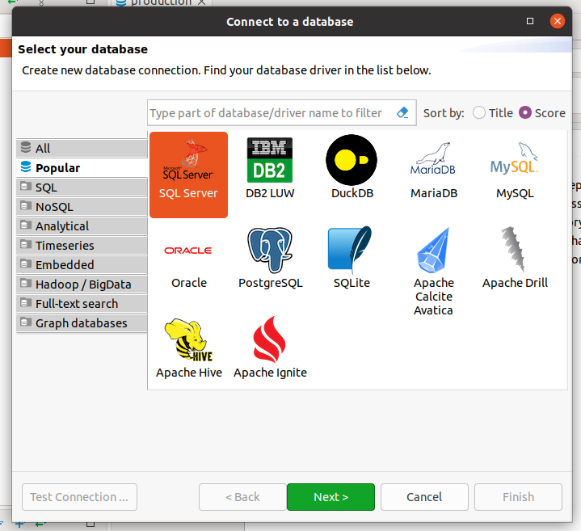
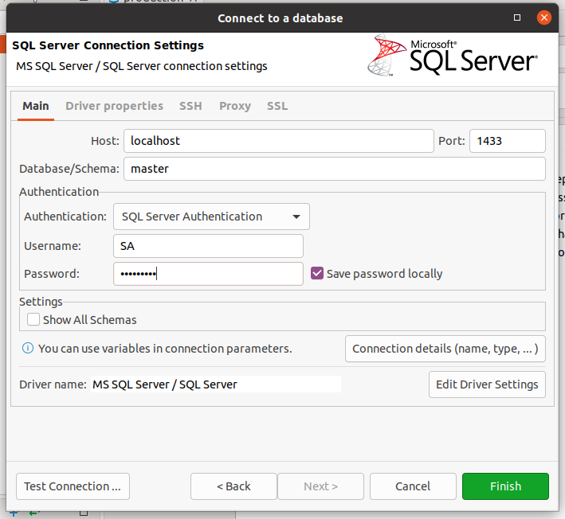
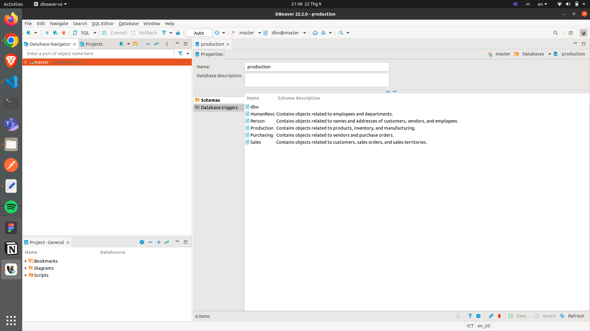

# data-engineering-assignment

Production application (Flask + DynamoDB + Vue + Element UI + Docker)

### Install DbeaverCE to connect with the MSQL SERVER

https://dbeaver.io/download/

Then, connect with the database. Click the icon connect database to do step 1. Choose SQL Server and install required packages.

To continue, click "Next".

Write the following information: Host, Database, Username and password of your settings. Then click "Finish".

Now you can access the database and can use Dbeaver CE tools such as automatically generate ER Diagram and view data tables and relationships of each attribute and data.
