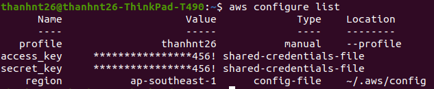
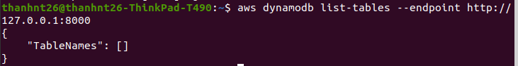

### Run container Dynamodb

`cd docker`
`cd dynamodb`
`docker compose up -d`

### Create network

`docker network create lambda-local`

### Download image and run container, then run dynamodb-local:

`docker run --network=lambda-local --name dynamo -p 8000:8000 amazon/dynamodb-local`

### Configure profile

`aws configure`

AWS Access Key ID[None]: `Aa123456!`
AWS Secret Access Key[None]: `Aa123456!`
Default region name[None]: `ap-southeast-1`
Default output format[None]: `json`

Or you can change this information at hidden file "/home/.asw" (MacOS, Linux)

Add your profile name:
`[profile thanhnt26]`
`region = ap-southeast-1`
`output = json`

#### Check Configure List

`aws configure list`

### Show Dynamo Tables:

`aws dynamodb list-tables --endpoint http://127.0.0.1:8000`

