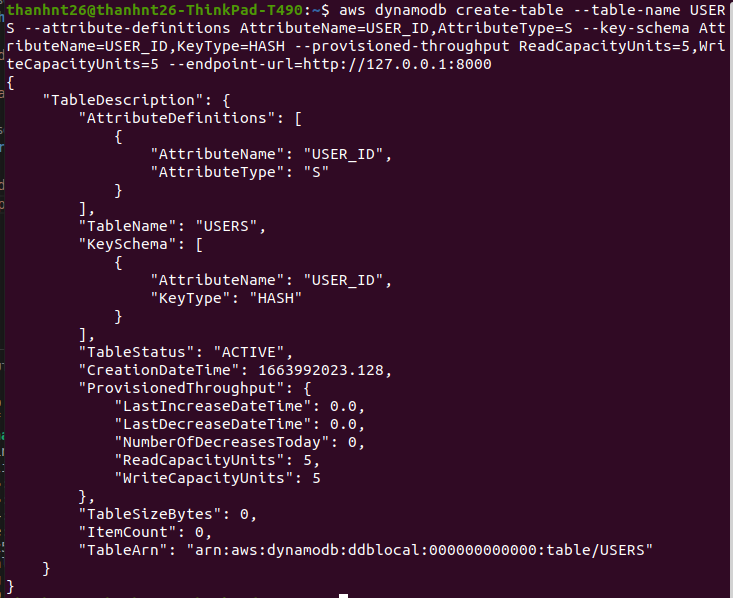
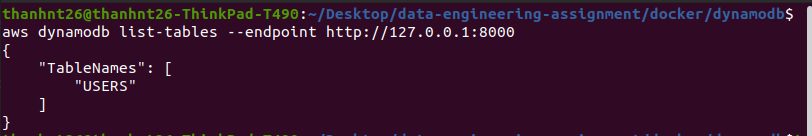
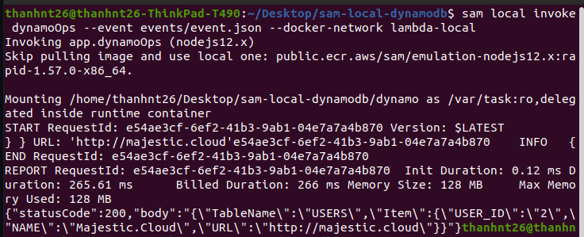

### Go to this path

`cd docker` \
`cd dynamodb`

### Create network

`docker network create lambda-local`

### Download image and run container, then run dynamodb-local

`docker run --network=lambda-local --name dynamo -p 8000:8000 amazon/dynamodb-local`

### Configure profile

`aws configure`

AWS Access Key ID[None]: `Aa123456!` \
AWS Secret Access Key[None]: `Aa123456!` \
Default region name[None]: `ap-southeast-1` \
Default output format[None]: `json`

Or you can change this information at hidden file "/home/.asw" (MacOS, Linux)

Add your profile name:
`[profile thanhnt26]`
`region = ap-southeast-1`
`output = json`

#### Check Configure List

`aws configure list`

### Show Dynamo Tables:

`aws dynamodb list-tables --endpoint http://127.0.0.1:8000`

### Create table USER

`aws dynamodb create-table --table-name USERS --attribute-definitions AttributeName=USER_ID,AttributeType=S --key-schema AttributeName=USER_ID,KeyType=HASH --provisioned-throughput ReadCapacityUnits=5,WriteCapacityUnits=5 --endpoint-url=http://127.0.0.1:8000`

Show table:

### Invoke a local Lambda function in the docker network

- Install sam
  https://docs.aws.amazon.com/serverless-application-model/latest/developerguide/serverless-sam-cli-install-linux.html

- Run the following command:
  `sam local invoke dynamoOps --event events/event.json --docker-network lambda-local`

